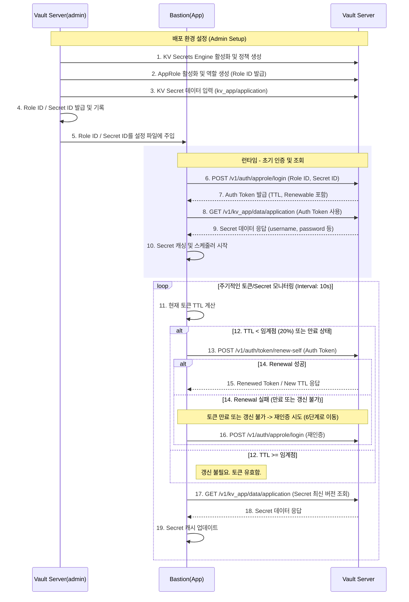

# hcp-vault-app-sample


## 언어 별 Vault 라이브러리 

| 언어          | 라이브러리명                                                 | 공식/비공식                       | 사용 방식/예제                                               | 지원 기능 범위                                               | 문서 링크                                                    |
| :------------ | :----------------------------------------------------------- | :-------------------------------- | :----------------------------------------------------------- | :----------------------------------------------------------- | :----------------------------------------------------------- |
| **Golng**     | **[vault/api](https://pkg.go.dev/github.com/hashicorp/vault/api) [vault-client-go](https://github.com/hashicorp/vault-client-go)** | **HashiCorp 공식**                | **go get github.com/hashicorp/vault-client-go 객체 생성 후 API 호출** | **Vault 전 영역(공식 지원, 최신 반영)**                      | **[Go 공식 API](https://pkg.go.dev/github.com/hashicorp/vault/api)** |
| **.NET (C#)** | **[HashiCorp.Vault](https://github.com/hashicorp/vault-client-dotnet) [VaultSharp](https://github.com/rajanadar/VaultSharp)** | **HashiCorp 공식(OpenAPI, Beta)** | **Nuget 패키지 배포 객체 생성 후 메서드 사용**               | **OpenAPI 기반 모든 엔드포인트, 인증 방식, KV, Transit 등**  | **[.NET 공식 문서](https://github.com/hashicorp/vault-client-dotnet)** |
| Java          | [spring-vault](https://docs.spring.io/spring-vault/docs/current/reference/html/) [vault-java-driver](https://github.com/BetterCloud/vault-java-driver) [vault-java](https://github.com/jhaals/vault-java) | 커뮤니티                          | Spring Integration 또는 객체 생성 후 API 사용                | 인증방식, KV, Transit, PKI 등 (spring-vault는 Spring 연동 특화) | [spring-vault](https://docs.spring.io/spring-vault/docs/current/reference/html/) [vault-java-driver](https://github.com/BetterCloud/vault-java-driver) |
| Java (Kotlin) | [kault](https://github.com/Hansanto/kault) [vault-kotlin](https://github.com/kunickiaj/vault-kotlin) | 커뮤니티                          | 객체 생성 후 메소드 사용                                     | 제한적(인증, KV 등)                                          | [kault](https://github.com/Hansanto/kault)                   |
| C             | 직접 HTTP API 호출, 오픈소스 소수                            | 공식 없음                         | curl/http로 직접 연동 또는 소규모 프로젝트 활용              | RestAPI 로 처리                                              | [Vault HTTP API Spec](https://developer.hashicorp.com/vault/api-docs) |
| C++           | [libvault](https://github.com/abedra/libvault)               | 커뮤니티                          | Vault::Client 등 객체 사용, cURL 기반                        | 제한적(인증, KV, Transit 등)                                 | [libvault](https://github.com/abedra/libvault)               |
| Node.js       | [node-vault](https://github.com/nodevault/node-vault) [node-vault-client](https://www.npmjs.com/package/node-vault-client) | 커뮤니티                          | npm install node-vault require 후 메소드 사용                | 제한적(인증, KV, Transit 등)                                 | [node-vault 명세](https://github.com/nodevault/node-vault)   |
| Python        | [hvac](https://pypi.org/project/hvac/)                       | 커뮤니티                          | pip install hvac import hvac 후 사용                         | 대부분 지원(인증, KV, Transit, PKI 등)                       | [hvac 공식문서](https://hvac.readthedocs.io/)                |

### 세부 내용

#### 공식/비공식 구분

- **HashiCorp 공식 지원**: Go, .NET(OpenAPI 기반)
- **커뮤니티**: Python, Java, Kotlin, C/C++, Node.js

#### 사용 방식 및 실제 예시 코드

- 대부분 Client/Session 객체 생성하여 API 호출( `client.read("secret/foo")`)

#### 지원 기능 범위

- Go, .NET 공식 클라이언트는 최신 API의 대부분(모든 주요 엔진, 인증, wrapping, ACL 등) 구현
- Java, Python(hvac), Node.js(node-vault) 등은 인증, KV, Transit, PKI 등 Vault 핵심 기능 대부분 지원
- Kotlin, C/C++ 등은 상대적 지원 범위가 제한적, RestAPI/cURL 등을 사용하여 직접 Vault 기능 사용 권장

#### 공식 문서 링크

- HTTP API 문서: https://developer.hashicorp.com/vault/api-docs


## 언어 별 샘플 코드에서 사용된 라이브러리 또는 방식

| **언어**          | **Vault 통신 방식**                | 사용한 라이브러리 또는 방식                                  |
| ----------------- | ---------------------------------- | ------------------------------------------------------------ |
| **Golang **       | **공식 Vault API 클라이언트** 사용 | `github.com/hashicorp/vault/api`                             |
| **.NET(C#)**      | **REST API 호출**                  | **`System.Net.Http.HttpClient`**, **`System.Text.Json`**     |
| **Java**          | **REST API 호출**                  | **Apache HttpClient 5** (`org.apache.hc.client5`), **Jackson** (`com.fasterxml.jackson.databind`) |
| **Java (Kotlin)** | **REST API 호출**                  | **OkHttp** (`okhttp3`), **Moshi** (`com.squareup.moshi`)     |
| **C**             | **REST API 호출**                  | **libcurl** (`curl/curl.h`), **jansson** (`jansson.h`)       |
| **C++**           | **REST API 호출**)                 | **libcurl** (`curl/curl.h`), **nlohmann/json** (`nlohmann/json.hpp`) |
| **Node.js**       | **REST API 호출**                  | **Axios** (`axios`), `node-schedule`                         |
| **Python**        | **Vault API 클라이언트** 사용      | **hvac**                                                     |


## 테스트 환경 샘플 코드 워크플로우




## 테스트 환경 설정 - Vault KV 및 Auth(AppRole)

### 환경 변수 선언
```bash
export VAULT_ADDR="http://127.0.0.1:8200"
export VAULT_POC_NAMESPACE="poc-main"
export KV_PATH="kv_app"
export KV_SECRET_PATH="application"
export KV_USERNAME="admin"
export KV_PASSWORD="1234"
export KV_CONN_URL="10.10.10.1"

export VAULT_POLICYNAME="kv-app-policy"
export VAULT_APPROLE_ROLENAME="kv-app-role"
export VAULT_APPROLE_TOKEN_TTL="2m"
export VAULT_APPROLE_TOKEN_MAX_TTL="1h"
export VAULT_APPROLE_SECRET_ID_TTL="1h"
export VAULT_APPROLE_SECRET_ID_NUM_USES="0"

```

### CLI 명령어 (환경 변수 적용)
```bash
# 기본 설정
vault namespace create "${VAULT_POC_NAMESPACE}"
export VAULT_NAMESPACE="${VAULT_POC_NAMESPACE}"

# 시크릿 엔진 생성 및 샘플 데이터 구성
vault secrets enable -namespace="${VAULT_NAMESPACE}" -path="${KV_PATH}" kv-v2

vault kv put -namespace="${VAULT_NAMESPACE}" "${KV_PATH}/${KV_SECRET_PATH}" username="${KV_USERNAME}" password="${KV_PASSWORD}" conn_url="${KV_CONN_URL}"

# 정책 생성
vault policy write -namespace="${VAULT_NAMESPACE}" "${VAULT_POLICYNAME}" - <<EOF
path "${KV_PATH}/data/*" {
  capabilities = ["read", "list"]
}
path "auth/token/renew-self" {
  capabilities = ["update"]
}
EOF

# 인증 생성
vault auth enable -namespace="${VAULT_NAMESPACE}" approle

vault write -namespace="${VAULT_NAMESPACE}" auth/approle/role/"${VAULT_APPROLE_ROLENAME}" \
  token_policies="${VAULT_POLICYNAME}" \
  token_ttl="${VAULT_APPROLE_TOKEN_TTL}" \
  token_max_ttl="${VAULT_APPROLE_TOKEN_MAX_TTL}" \
  secret_id_ttl="${VAULT_APPROLE_SECRET_ID_TTL}" \
  secret_id_num_uses="${VAULT_APPROLE_SECRET_ID_NUM_USES}"


# approle 발급
vault read -namespace="${VAULT_NAMESPACE}" auth/approle/role/"${VAULT_APPROLE_ROLENAME}"/role-id >> approle_id.txt
vault write -namespace="${VAULT_NAMESPACE}" -f auth/approle/role/"${VAULT_APPROLE_ROLENAME}"/secret-id >> approle_id.txt

# approle login(확인목적)
vault write -namespace="${VAULT_NAMESPACE}" auth/approle/login role_id=xxxx secret_id=xxx
```
